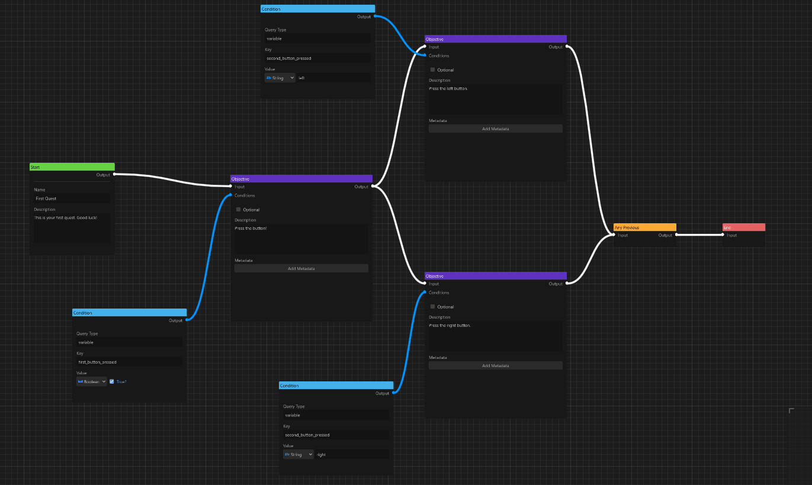

# Questify

A graph-based quest editor and manager for Godot 4.



# Usage

## Installation

1. Copy addons/questify directory to you addons directory.
2. Enable Questify plugin.
3. Restart the editor.
4. It's done! You can access the editor screen by clicking on the *Questify* button in the top of the editor.

## Basics

Each quest resource is composed of graph nodes. Quest should have exactly one Start Node and one End Node, to which all paths should converge.

### Creating/editing a quest

A new quest can be created in the Questify tab by clicking on the new file icon, clicking on load button or by double-clicking an existing quest resource in the FileSystem tab in Godot.

You can add nodes to the graph by either using an Add button in the top or by right-clicking anywhere in the graph plane.

Questify also handles undo/redo for most actions, like pasting and deleting.

### Starting the quest

In order to start the quest in your code, you have to load the `QuestResource` you have created and instantiate it. This is done to ensure no modification to the original resource was done. Then, you can simply start it using `Questify` singleton like this:

```gdscript
@export var quest: QuestResource

func _ready() -> void:
  var instance := quest.instantiate()
  Questify.start_quest(instance)
```

### Observing quest states

Questify singleton exposes several signals to keep track of active quests.

```gdscript
signal quest_started(quest: QuestResource)
signal quest_objective_added(quest: QuestResource, objective: QuestObjective)
signal quest_objective_completed(quest: QuestResource, objective: QuestObjective)
signal quest_completed(quest: QuestResource)
```

`quest_started` is emitted every time a new quest is started.

`quest_objective_added` is emitted every time a new objective becomes active.

`quest_objective_completed` is emitted when objective is completed and becomes inactive.

`quest_completed` is emitted when quest is finished, i.e. end node has completed.

### Handling condition queries

Questify uses an architecture-agnostic query system to handle quest conditions. This is due to some of the limitations of Godot plugins, but has some advantages. This way Questify can be setup without much work on your part.
Questify will emit proper query signal and you just have to handle each type of query and set the objective as completed.

This signal has following signature:

```gdscript
signal condition_query_requested(type: String, key: String, value: Variant, requester: QuestCondition)
```

As an example, you can setup this simple handler somewhere in your DataManager and quests will be updated properly:

```gdscript
Questify.condition_query_requested.connect(
  func(type: String, key: String, value: Variant, requester: QuestCondition):
	if type == "variable":
	  if get_value(key) == value:
		requester.set_completed(true)
)
```

Of course, you might need to use more operators than equality in queries, but this can be easily done by handling different subtypes of query type string, making for a quite elaborate and powerful system. For example, it could look like this in your DataManager or equivalent class:

```gdscript
Questify.condition_query_requested.connect(
  func(type: String, key: String, value: Variant, requester: QuestCondition):
	if type.begins_with("var"):
	  var operator := type.get_slice(":", 1)
	  var variable := get_value(key)
	  var result := false
	  match operator:
		type, "eq", "==":
		  result = variable == value
		"neq", "ne", "!eq", "!=":
		  result = variable != value
		"lt", "<":
		  assert(not variable is bool, "Incorrect variable type for quest condition query operator")
		  result = variable < value
		"lte", "<=":
		  assert(not variable is bool, "Incorrect variable type for quest condition query operator")
		  result = variable <= value
		"gt", ">":
		  assert(not variable is bool, "Incorrect variable type for quest condition query operator")
		  result = variable > value
		"gte", ">=":
		  assert(not variable is bool, "Incorrect variable type for quest condition query operator")
		  result = variable >= value
		_:
		  printerr("Unknown operator '%s' in quest condition query" % operator)
	  requester.set_completed(result)
)
```

In the example above, you can now use more complex query types, like: `var`, `var:>`, `variable:lte` etc.

### Triggering condition checks

By default, Questify uses a simple periodical polling mechanism to send a query request via its signal.
Check interval is 0.5 seconds by default, but can be changed in `Project Settings -> Questify -> General -> Update Interval`.

Since this might be less performant than on-demand updates and is more suited for smaller projects, this behavior can be toggled off in settings: `Project Settings -> Questify -> General -> Update Polling`.
If it's disabled, you have to manually trigger quest updates using `Questify.update_quests()` when e.g. some data changes in your DataManager (or its equivalent). This will immediately send query requests from all active objectives.

Condition polling can also be paused from code when necessary (e.g. when the game is paused):

```gdscript
Questify.toggle_update_polling(false) # or `true` if enabling it back.
```

This will do nothing if `Update Polling` setting is off.

### Serialization and deserialization
For most cases, Questify can holistically serialize and deserialize state of current quests using methods provided to the autoload:

```gdscript
var serialized_state := Questify.serialize() # returns Array
Questify.deserialize(serialized_state)
```

All the saved quests will be instantiated and deserialized immediately.

If you need to serialize/deserialize quests on your own, quest state can be serialized to a `Dictionary` using `serialize()` and `deserialize()` methods provided by `QuestResource`. However, to be deserialized, quests have to be instantiated from the original resource and then added to the Questify singleton manually. This can be done by passing an array of deserialized quests to Questify. This could look like this:

```gdscript
# before saving
for quest_instance in quests:
	var serialized_quest := quest_instance.serialize() # returns Dictionary
	# getting resource path using this method is necessary, since instances do not have `resource_path` property
	var quest_path = quest_instance.get_resource_path()
	# ...do other serialization stuff

# after loading
var quests: Array[QuestResource] = []
for quest in serialized_quests:
	# ...load proper quest resource
	var instance := quest.resource.instantiate()
	instance.deserialize(quest.data) # quest.data could be whatever property you use to store the serialized data
	quests.append(instance)
Questify.set_quests(quests)
```

And that's it!

### Utilities

You can get an Array of active and completed quests at any time, by using `Questify.get_active_quests()` and `Questify.get_completed_quests()` respectively.

# Quest Nodes

Nodes have two internal states:

* `active`
* `completed`

## Active state

Active state marks the node as active and processable. For example, active state in Start Node means that the quest was started and the system can process its child nodes. Most nodes will retain their active state once they become active, with a major exception for objective node. Objective will become inactive when completed. Also, condition nodes do not use active state in general, since they're only active when connected objective is active.

## Completed state

Completed state means that the node has passed all the conditions and won't be processed anymore. Each node has its own rules for being completed. However, most importantly, objectives can only become completed if all of the attached condition nodes become completed (i.e. conditions are true).

## Available nodes

### Start Node

The entry point of any quest. There can be only exactly one in each quest. Quest is considered started, when start node's `active` state is (manually) set to true.

### End Node

The node marking the end (and completion) of a quest. There should be only one in quest. End node (and quest in general) is considered completed, when all connected previous nodes are completed.

### Objective Node

The main building block of a quest, the objective node denotes any steps in quest that player need to take in order to finish it. Node itself stores the objective description, whether it's optional and metadata, useful for adding things like coordinates for quest markers on minimap. There can be many objectives in parallel, but I will talk about branching a little bit later.

By setting `optional` to true, any next node will treat this objective as completed, regardless of actual `completed` state.

Metadata make use of Godot's meta functionality (see: https://docs.godotengine.org/en/stable/classes/class_object.html#class-object-method-get-meta for more details). This allows objective nodes to keep some dynamic data that can be accessed by your game at any time. This can be useful for storing things like map markers etc. 

If you create a meta value called `marker`, you can later retrieve the data using `get_meta`:

```gdscript
objective.get_meta("marker")
```

### Condition Nodes (Condition Node, Any Condition Node, Not Condition Node)

In order for objectives to work, one or more conditions need to be attached to the objective node. Condition nodes use a special type of cdonnection, so you don't have to worry about connecting condition to where you're not supposed to. 

By default, ALL the attached conditions need to pass for objective to be completed. You can modify this behavior by attaching `Any Condition` node and `Not Condition` node which do exactly what they say on the tin: 
* `Any Condition` will make the condition pass when at least one of the attached conditions is true. 
* `Not Condition` will negate the output of connected conditions, including `Any Condition` node.

### Branching Nodes (Any Previous Node, Exclusive Branch Connector Node)

When connecting objectives in parallel, each branch will have to be fully completed in order for the graph to go further. However, quests should allow for proper branching - you might want to allow only one of many paths to finish the quest. For this purpose, Questify includes `Any Previous` and `Exclusive Branch Connector` nodes.

* `Any Previous` will be completed when at least one of its parent objectives is completed (Disclaimer: `optional` will be treated as `completed` in this case!).
* `Exclusive Branch Connector` is a special kind of node with no outputs and is necessary for longer branches to operate correctly. While simple `Any Previous` node at the end of short, one-layer deep branches will work fine, `Exclusive Branch Connector` is necessary for longer ones. Attach outputs of the first objectives of each branch to this nodes inputs and whenever player completes one of them, others will become inactive and unavailable. This takes advantage of the `active`/`completed` state model, as objective cannot be active when one of its children is active - in this case it means that `Exclusive Branch Connector` becomes active and in turn disables other branches.


### Conditional Branch Node

In case you want some quest branches to be visible only if certain conditions are met, you can use Conditional Branch Node. Simply attach inputs and outputs and proper conditions and voila! - The objectives attached to the output will be only available when conditions are met.

However, please be aware that in this case use of Any Previous or Exclusive Branch Node might be necessary for quest to flow properly.

# License
Distributed under the [MIT License](https://github.com/TheWalruzz/godot-questify/blob/main/LICENSE).
